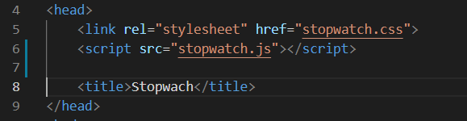
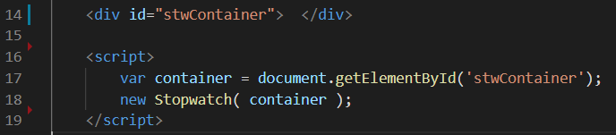

# stopwatch

Live demo: http://js.stopwatch.yusuf.arslanalp.surge.sh/

### Usage
Import the files into the head tag of the html file.

Give the html element to the stopwach object.

### Docker Usage
docker build -t html-server-image:v1 .
docker run -d -p 80:80 html-server-image:v1
go to localhost:80 in browser
